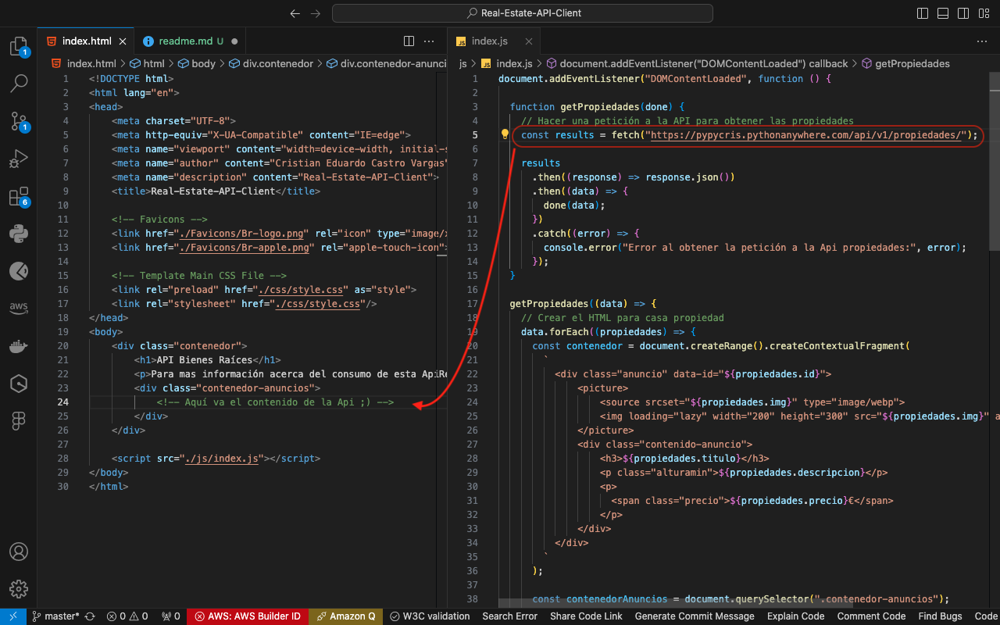
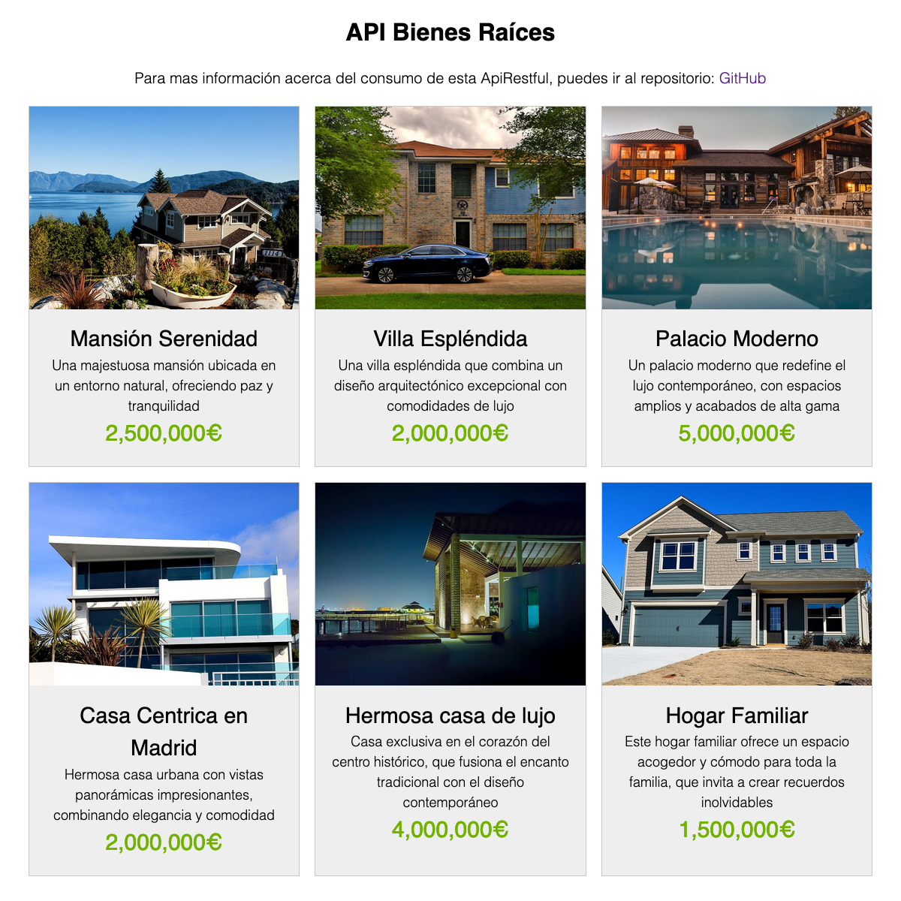

# API Restful - Bienes Raíces

Este repositorio contiene una demostración sencilla que utiliza tecnologías básicas del lado del cliente para interactuar con la **API Restful** desarrollada con **Django Rest Framework**.

La API permite realizar **operaciones de lectura**, lo que facilita su integración con aplicaciones web, móviles, de escritorio, y otros servicios que requieran acceso a la información de las propiedades.

## Tecnologías Utilizadas

Para esta demostración, se han utilizado las siguientes tecnologías:

<ul>
  <li></li>
  <li></li>
  <li></li>
</ul>

## Uso de la API

Puedes `clonar` el repositorio para acceder a los archivos HTML, CSS y JavaScript. 

La demostración incluye un ejemplo simple de cómo realizar una solicitud `fetch` a la URL de la API utilizando JavaScript. Si la respuesta es exitosa (código 200), los datos se muestran en el contenedor dentro del archivo `index.html`

<p align="center">
  
</p>

## Visualizacion de la interfaz 

Puedes ver el resultado final en el siguiente enlace. Ten en cuenta que el proyecto está alojado en un servidor gratuito, por lo que podría tardar un poco en cargar. ¡Gracias por tu paciencia! 😉

```bash
  https://api.cristian-castro.com/
```

<p align="center">
  
</p>

En la interfaz se visualizan los siguientes datos serializados:

- **Imagen de la propiedad**
- **Título**
- **Descripción**
- **Contenido**
- **Precio**

Al hacer clic en la tarjeta de la propiedad, se mostrarán los detalles específicos de la misma.

## Contacto

Cristian Eduardo Castro Vargas  
[Email](mailto:cj.94@hotmail.com) | [LinkedIn](https://www.linkedin.com/in/cristian-castro-vargas/) | [Portafolio](https://cristian-castro.com/)
